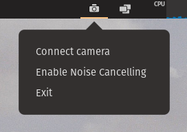

# CamAndEcho
A tray application for using a e.g. dslr camera as webcam and for activating the echo-cancel-module of pulseaudio.
</br>

</br>
Just connect your camera via USB an click "Connect camera".
In your app of choice, select the camera input source "CamToWebcam"

## How does it work?
For grabbing the video from a connected camera, it uses the gphoto2 application. The grabbed video stream then gets converted by ffmpeg and pushed into a virtual webcam named CamToWebcam created via v4l2.

[CAMERA] => gphoto2 -> ffmpeg -> v4l2 (CamToWebcam)

## Why does it ask for my password when connecting to camera?
Because it creates a temporary virtual webcam via v4l2 and thus it needs root access. The application itself does not ask for your password. This is done by a command called ```pkexec```.
</br>
The full command for creating the virtual webcam is:</br> 
```pkexec modprobe v4l2loopback devices=1 video_nr=10 card_label="CamToWebcam"```.
</br>
If you a curious, look up the file [src/V4L2Driver.ts](./src/V4L2Driver.ts)


# Setup
## Dependencies
- gphoto2
- ffmpeg
- v4l2loopback-utils
- v4l2loopback-dkms

On Debian based OS:</br>
```sudo apt-get install gphoto2 ffmpeg v4l2loopback-utils v4l2loopback-dkms```
</br></br>
On Redhat base OS:</br>
```sudo dnf install gphoto2 ffmpeg v4l2loopback```

## Run the code
First of all in the root directory, run following command to install all dependencies:
```yarn```

- Start the application: ```yarn start```
- Build the application: ```yarn dist```

```yarn dist``` creates a .deb, appimage and the unpacked application in the ```dist``` folder.

# Tested setup
- OS: Pop OS 20.10
- Camera: Canon EOS 200D